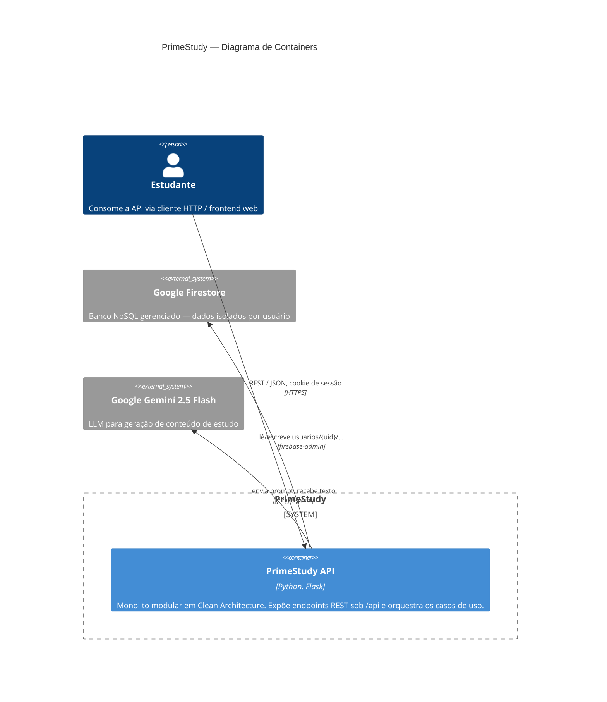
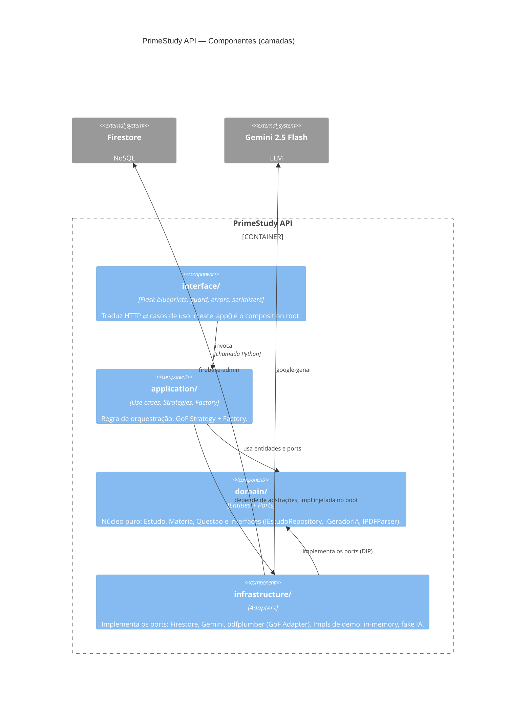

# C4 — Containers e Componentes

> Reflete o código real: monolito modular (ADR-001) em Clean Architecture
> (ADR-002), API JSON Flask sobre Firestore (ADR-003) e Gemini 2.5 Flash (ADR-004).

## Nível 2 — Containers

A aplicação é **uma** unidade implantável (o processo Flask). As camadas internas
são componentes desse mesmo container, não serviços separados.

## Nível 3 — Componentes (dentro do container API)

