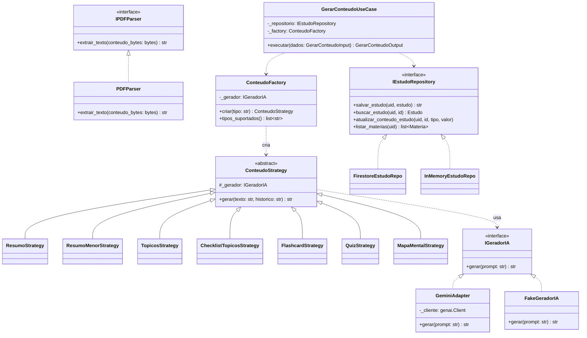

# Diagrama de Classes — Padrões GoF

> Nomes idênticos ao código (`src/`). Três padrões GoF — Strategy, Factory
> Method, Adapter — mais Repository (Fowler) como bônus.

```mermaid
classDiagram
    %% ───────── STRATEGY (comportamento) ─────────
    class ConteudoStrategy {
        <<abstract>>
        #_gerador: IGeradorIA
        +gerar(texto: str, historico: str) str
    }
    class ResumoStrategy
    class ResumoMenorStrategy
    class TopicosStrategy
    class ChecklistTopicosStrategy
    class FlashcardStrategy
    class QuizStrategy
    class MapaMentalStrategy
    ConteudoStrategy <|-- ResumoStrategy
    ConteudoStrategy <|-- ResumoMenorStrategy
    ConteudoStrategy <|-- TopicosStrategy
    ConteudoStrategy <|-- ChecklistTopicosStrategy
    ConteudoStrategy <|-- FlashcardStrategy
    ConteudoStrategy <|-- QuizStrategy
    ConteudoStrategy <|-- MapaMentalStrategy

    %% ───────── FACTORY METHOD (criação) ─────────
    class ConteudoFactory {
        -_gerador: IGeradorIA
        +criar(tipo: str) ConteudoStrategy
        +tipos_suportados() list~str~
    }
    ConteudoFactory ..> ConteudoStrategy : cria

    %% ───────── ADAPTER (estrutura) ─────────
    class IGeradorIA {
        <<interface>>
        +gerar(prompt: str) str
    }
    class GeminiAdapter {
        -_cliente: genai.Client
        +gerar(prompt: str) str
    }
    class FakeGeradorIA {
        +gerar(prompt: str) str
    }
    IGeradorIA <|.. GeminiAdapter
    IGeradorIA <|.. FakeGeradorIA

    class IPDFParser {
        <<interface>>
        +extrair_texto(conteudo_bytes: bytes) str
    }
    class PDFParser {
        +extrair_texto(conteudo_bytes: bytes) str
    }
    IPDFParser <|.. PDFParser

    %% ───────── REPOSITORY (Fowler) ─────────
    class IEstudoRepository {
        <<interface>>
        +salvar_estudo(uid, estudo) str
        +buscar_estudo(uid, id) Estudo
        +atualizar_conteudo_estudo(uid, id, tipo, valor)
        +listar_materias(uid) list~Materia~
    }
    class FirestoreEstudoRepo
    class InMemoryEstudoRepo
    IEstudoRepository <|.. FirestoreEstudoRepo
    IEstudoRepository <|.. InMemoryEstudoRepo

    %% ───────── USE CASE depende de abstrações (DIP) ─────────
    class GerarConteudoUseCase {
        -_repositorio: IEstudoRepository
        -_factory: ConteudoFactory
        +executar(dados: GerarConteudoInput) GerarConteudoOutput
    }
    GerarConteudoUseCase ..> ConteudoFactory
    GerarConteudoUseCase ..> IEstudoRepository
    ConteudoStrategy ..> IGeradorIA : usa
```
