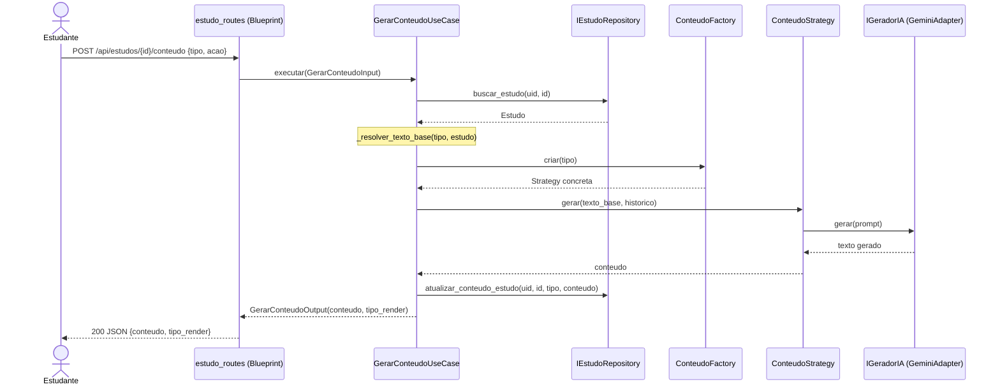

# Diagrama de Sequência — Gerar Conteúdo

> Fluxo real de `POST /api/estudos/{id}/conteudo` (body `{tipo, acao}`).
> A Strategy chama o `IGeradorIA` injetado; o use case persiste o resultado.

```mermaid
sequenceDiagram
    actor Estudante
    participant API as estudo_routes (Blueprint)
    participant UC as GerarConteudoUseCase
    participant Repo as IEstudoRepository
    participant Factory as ConteudoFactory
    participant Strategy as ConteudoStrategy
    participant IA as IGeradorIA (GeminiAdapter)

    Estudante->>API: POST /api/estudos/{id}/conteudo {tipo, acao}
    API->>UC: executar(GerarConteudoInput)
    UC->>Repo: buscar_estudo(uid, id)
    Repo-->>UC: Estudo
    Note over UC: _resolver_texto_base(tipo, estudo)
    UC->>Factory: criar(tipo)
    Factory-->>UC: Strategy concreta
    UC->>Strategy: gerar(texto_base, historico)
    Strategy->>IA: gerar(prompt)
    IA-->>Strategy: texto gerado
    Strategy-->>UC: conteudo
    UC->>Repo: atualizar_conteudo_estudo(uid, id, tipo, conteudo)
    UC-->>API: GerarConteudoOutput(conteudo, tipo_render)
    API-->>Estudante: 200 JSON {conteudo, tipo_render}
```
